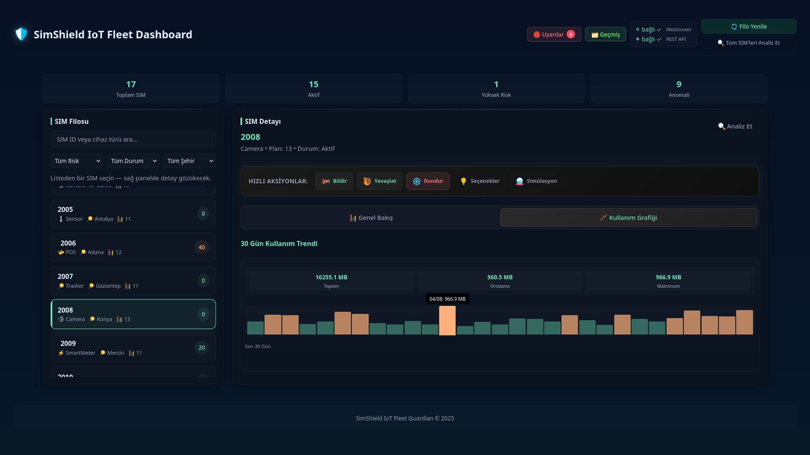
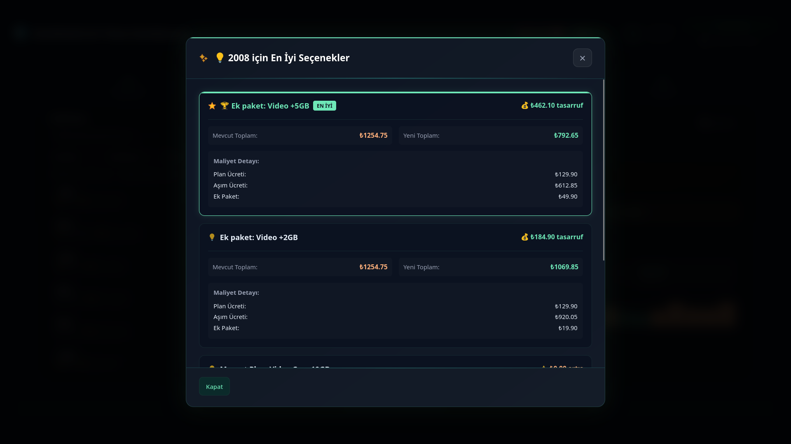
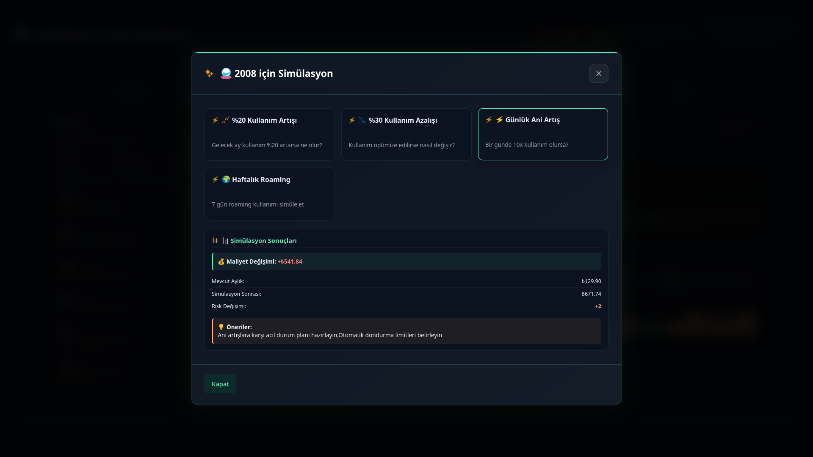
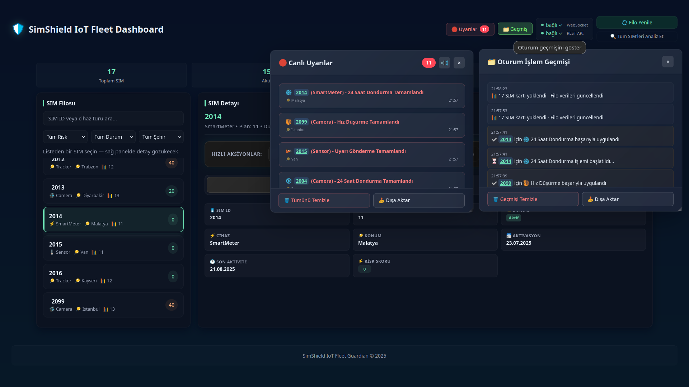

# 🛡️ SimShield IoT Fleet Guardian

**IoT SIM Filo Koruyucu** - Anomali Tespiti ve Maliyet Optimizasyonu

## 📋 Proje Açıklaması

SimShield, IoT cihazlarının SIM kartlarını izleyen, anomalileri tespit eden ve maliyet optimizasyonu sağlayan akıllı bir sistemdir. Ani veri tüketimi, beklenmedik roaming ve bağlantı sorunlarını tespit ederek hem maliyet hem operasyon risklerini azaltır.

## ✨ Temel Özellikler

- **📊 Akıllı Filo Panosu**: Risk bazlı SIM yönetimi ve filtreleme
- **📈 Anomali Tespiti**: Gerçek zamanlı anomali analizi ve görselleştirme
- **💰 Maliyet Simülatörü**: What-if senaryoları ve plan optimizasyonu
- **🚨 Canlı Uyarılar**: WebSocket tabanlı gerçek zamanlı bildirimler

## 📸 Uygulama İçi Görseller

  

  

  

  

  

